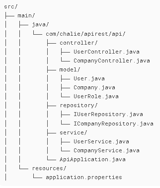

# API REST Spring Boot - Sistema de Gestion de Ususarios y Companías

## Descripción

API RESTful desarrollada con Spring Boot que gestiona usuarios y compañías con relaciones Many-to-One y sistema de
roles.

## Nuevas Funcionalidades Implementadas

### Relación User - Company

Relación Many-to-One: Cada usuario pertenece a una compañía

Relación One-to-Many: Cada compañía puede tener múltiples usuarios

Validaciones de integridad referencial

## Sistema de Roles

Enum UserRole: ADMIN, MANAGER, EMPLOYEE, VIEWER

## Restricciones de negocio:

Validación automática de roles

Solo acepta roles :  ADMIN, MANAGER, EMPLOYEE  
Sino especifica que rol es, automáticamente designa a ser empleado

# Endpoints

Users endpoints:
http://localhost:8080

- GET /api/users
- POST /api/users
- GET /api/users/{id}
- DELETE /api/users/{id}
- GET /api/users/company/{companyId}
- GET /api/users/role/{role}
- GET /api/users/company/{companyId}/role/{role} :   Ejemplo : Obtener todos los ADMINS ---->
  GET http://localhost:8080/api/users/role/ADMIN

Company endpoints:
http://localhost:8080

- GET /api/companies
- POST /api/companies
- GET /api/companies/{id}
- DELETE /api/companies/{id}

## Tecnologías Utilizadas

Spring Boot 3.3.3

Spring Data JPA

H2 Database (memoria)

Lombok

Maven

## Estructura del proyecto:

## Ejecución del proyecto con  Bd(h2) en Memoria:

Ejecutar el proyecto desde ApiAplication :

	public static void main(String[] args) {
		SpringApplication.run(ApiApplication.class, args);
	}

}

Acceder en http://localhost:8080/h2-ui   JDBC URL: jdbc:h2:mem:testdb  Usuario: sa  Contraseña: vacia

Ingresar manualmente los datos en las tablas y probar cada enpoint o bien probar los endpoints con postman.

